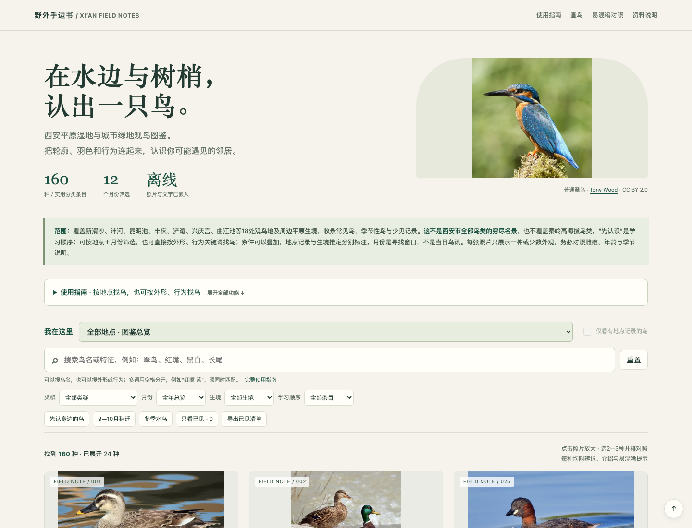

# 西安观鸟图鉴

160种鸟类参考图鉴，附真实照片、识别特点、介绍、月份、生境与易混淆提示。支持18处观鸟地筛选，单文件离线使用。



## 使用

下载仓库后，用浏览器打开根目录的 **`index.html`**。无需安装依赖；约15 MB，图片和资料已嵌入。

**可以按地点找鸟，也可以按看见的特征找鸟，两种方式可以组合使用。**

- **到现场查候选：** “我在这里”选地点 → 选月份 → 需要时再选生境。例如“新渭沙 + 9月 + 芦苇”。
- **看到鸟查名字：** 在搜索框输入 `红嘴`、`长尾`、`悬停`、`潜水` 等短词；多个词用空格分开，如 `红嘴 蓝`，要求同时匹配。也支持中文鸟名、学名和英文参考名。
- **进一步缩小范围：** 可叠加类群、学习顺序、“仅看有地点记录”和“只看已见”。

| 筛选入口 | 用法 |
|---|---|
| 我在这里 | 18处观鸟地，或选择全部地点总览；不读取GPS |
| 搜索框 | 名称／外形／行为等关键词匹配，多词取交集；不是拍照识鸟或语义识别 |
| 类群 | 如雁鸭与天鹅、猛禽与鸮等图鉴分组 |
| 月份 | 按该月推荐观察窗口筛选；“全年总览”取消月份限制 |
| 生境 | 如湖泊、河流、芦苇、树林、草地、农田 |
| 学习顺序 | 先认识、再留意、进阶辨认、少见记录；不是出现概率 |
| 仅看有地点记录的鸟 | 先选地点，再排除仅按生境推定的候选 |
| 只看已见 | 在当前条件下只显示自己标记过的鸟 |

普通条件同时生效，**满足全部条件才显示**。特征搜索只匹配文字，`长尾`和`尾长`不会自动互认；没有结果时换短词、减少限制，或点击“重置”。

**快捷按钮：** “先认身边的鸟”筛选36种入门鸟；“9—10月秋迁”覆盖两个月中任一月的候选；“冬季水鸟”覆盖11月至次年2月的水鸟候选。前三个快捷按钮会保留地点与地点记录限制，重设其他筛选后应用快捷条件。精确组合请直接使用下拉框。

**其他功能：** 点照片放大；展开卡片查看雌雄和季节差异；选2—3种并排对照；标记已见并导出CSV。已见与最近地点保存在本地，不跨设备同步。导出包含**全部已标记鸟**，不受当前筛选限制；“重置”不删除已见标记或对照项。

默认显示24种，底部“继续查看”展开更多；搜索与筛选始终覆盖全部160种。页面顶部及筛选区有 **“使用指南”**，也可直接阅读 [完整使用说明](docs/使用说明.md)。

地点包含新渭沙、沣河文教园段、沣东沣河生态景区、沣渭、昆明池、丰庆、兴庆宫、大明宫、汉城湖、环城公园、曲江池、樊川、浐灞国家湿地公园、灞河西岸滨河公园、雁鸣湖、桃花潭、世博园广运潭、西安湖。

**地点记录与推定分开显示：** 有地点记录只代表资料曾提及；按生境推定的候选不是现场确证，也不表示一定可见。少见鸟只在有地点资料支持时纳入该地列表。月份为寻找窗口，全部列表仅覆盖本图鉴已有160种，不是全西安或单个地点的穷尽名录。

## 构建

需要 Python 3.10+ 和 Pillow。构建完全使用仓库内的图片与元数据，不需要联网抓取资料。

```sh
python3 -m venv .venv
source .venv/bin/activate
python -m pip install -r requirements.txt
python scripts/build_guide.py
```

Windows 中使用 `.venv\Scripts\activate` 激活环境。

构建生成 `index.html`、`data/guide.json` 和 `图片来源与许可.md`。修改界面请编辑 `scripts/template.html`，不要直接修改生成的 `index.html`。

## 验证

```sh
python scripts/validate_data.py
npm install
npx playwright install chromium
npm test
```

浏览器检查覆盖18个地点、已记载筛选、地点与月份交集、地点记忆、快速筛选、搜索、重置、手机宽度及离线请求。可通过 `CHROMIUM_EXECUTABLE_PATH` 指定已有Chromium。

## 维护数据

| 文件 | 用途 |
|---|---|
| `data/species.tsv` | 名录、月份、生境及学习顺序 |
| `data/descriptions.tsv` | 中文识别特点、介绍和混淆提示 |
| `data/places.json` | 地点信息、候选生境组合、逐种记录和来源 |
| `data/sources/` | 物种页面元信息与逐图许可 |
| `data/gbif_facets.json` | 区域记录检索快照；不作为精确公园记录 |
| `assets/` | 160张参考照片 |
| `scripts/places.py` | 地点数据校验与编译 |

`places.json` 中的 `profiles` 为人工整理的生境候选集合；`records` 必须附地点级来源，不可由生境匹配自动升级而来。新增鸟类应同时维护名录、中文描述、照片与许可信息。

## 来源与许可

所有参考照片来自 Wikimedia Commons，逐张作者和许可见 [图片来源与许可](图片来源与许可.md)。照片不默认拍摄于西安，部分为圈养参考个体。

资料使用管理机构发布、公开观鸟记录和逐种物种参考。图片各自适用原始许可，不可将它们统一声明为本项目原创；详细范围见 [第三方资料说明](THIRD_PARTY.md)。代码尚未选择额外开源许可证。

完整操作和资料说明见 [使用说明](docs/使用说明.md)。
